# InsightForge AI — Database Design

## 1. Conventions

| Convention | Detail |
|------------|--------|
| Primary keys | `UUID` (`gen_random_uuid()` or app-side `uuid4`) |
| Timestamps | `created_at`, `updated_at` (timestamptz, UTC) |
| Soft delete | `deleted_at` NULL = active |
| Multi-tenant | `organization_id` UUID NULL (reserved) |
| Naming | `snake_case` tables and columns |
| Indexes | FK columns, `email`, `code`, `user_id`, `dataset_id`, `created_at` |

## 2. Entity-Relationship Diagram

```mermaid
erDiagram
  users ||--o{ user_roles : ""
  roles ||--o{ user_roles : ""
  roles ||--o{ role_permissions : ""
  permissions ||--o{ role_permissions : ""

  users ||--o{ refresh_tokens : ""
  users ||--o{ password_reset_tokens : ""
  users ||--o{ email_verification_tokens : ""

  users ||--o{ datasets : owns
  datasets ||--|| dataset_metadata : ""
  datasets ||--o{ insights : ""
  datasets ||--o{ recommendations : ""

  users ||--o{ dashboards : ""
  dashboards ||--o{ dashboard_widgets : ""

  users ||--o{ reports : ""
  users ||--o{ forecasts : ""
  users ||--o{ ml_models : ""
  users ||--o{ notifications : ""
  users ||--o{ goals : ""
  users ||--o{ audit_logs : ""
  users ||--o{ assistant_conversations : ""

  users {
    uuid id PK
    uuid organization_id FK
    varchar email UK
    varchar hashed_password
    varchar full_name
    boolean is_active
    boolean is_superuser
    timestamptz email_verified_at
    timestamptz created_at
    timestamptz updated_at
    timestamptz deleted_at
  }

  roles {
    uuid id PK
    varchar name UK
    varchar description
    timestamptz created_at
    timestamptz updated_at
  }

  permissions {
    uuid id PK
    varchar code UK
    varchar resource
    varchar action
    varchar description
    timestamptz created_at
  }

  user_roles {
    uuid user_id PK,FK
    uuid role_id PK,FK
  }

  role_permissions {
    uuid role_id PK,FK
    uuid permission_id PK,FK
  }

  refresh_tokens {
    uuid id PK
    uuid user_id FK
    varchar token_hash UK
    timestamptz expires_at
    timestamptz revoked_at
    timestamptz created_at
  }

  datasets {
    uuid id PK
    uuid user_id FK
    uuid organization_id
    varchar name
    varchar file_name
    varchar file_format
    bigint file_size_bytes
    varchar storage_path
    varchar status
    timestamptz created_at
    timestamptz updated_at
    timestamptz deleted_at
  }

  dataset_metadata {
    uuid id PK
    uuid dataset_id FK,UK
    jsonb schema_json
    jsonb profile_json
    varchar dataset_type
    float confidence_score
    timestamptz created_at
    timestamptz updated_at
  }

  insights {
    uuid id PK
    uuid dataset_id FK
    uuid user_id FK
    varchar insight_type
    varchar severity
    text title
    text body
    jsonb evidence_json
    timestamptz created_at
  }

  dashboards {
    uuid id PK
    uuid user_id FK
    varchar name
    varchar dashboard_type
    jsonb layout_json
    timestamptz created_at
    timestamptz updated_at
    timestamptz deleted_at
  }

  dashboard_widgets {
    uuid id PK
    uuid dashboard_id FK
    varchar widget_type
    jsonb config_json
    int position_order
    timestamptz created_at
  }

  reports {
    uuid id PK
    uuid user_id FK
    uuid dataset_id FK
    varchar report_type
    varchar format
    varchar storage_path
    varchar status
    timestamptz created_at
  }

  forecasts {
    uuid id PK
    uuid dataset_id FK
    uuid ml_model_id FK
    jsonb forecast_json
    timestamptz created_at
  }

  recommendations {
    uuid id PK
    uuid dataset_id FK
    varchar recommendation_type
    jsonb payload_json
    float score
    timestamptz created_at
  }

  ml_models {
    uuid id PK
    uuid user_id FK
    uuid dataset_id FK
    varchar model_type
    varchar algorithm
    jsonb metrics_json
    varchar artifact_path
    varchar status
    timestamptz created_at
  }

  notifications {
    uuid id PK
    uuid user_id FK
    varchar category
    varchar title
    text message
    boolean is_read
    jsonb metadata_json
    timestamptz created_at
  }

  goals {
    uuid id PK
    uuid user_id FK
    varchar goal_type
    numeric target_value
    numeric current_value
    date period_start
    date period_end
    varchar status
    timestamptz created_at
    timestamptz updated_at
  }

  audit_logs {
    uuid id PK
    uuid user_id FK
    varchar action
    varchar resource_type
    uuid resource_id
    jsonb details_json
    varchar ip_address
    varchar user_agent
    timestamptz created_at
  }

  assistant_conversations {
    uuid id PK
    uuid user_id FK
    uuid dataset_id FK
    varchar title
    jsonb messages_json
    timestamptz created_at
    timestamptz updated_at
  }
```



## 3. Table Summary (Phase 1 Implemented vs Planned)

| Table | Phase | Notes |
|-------|-------|-------|
| `users` | 1 | Auth, profile |
| `roles`, `permissions`, `user_roles`, `role_permissions` | 1 | RBAC |
| `refresh_tokens` | 1 | Refresh rotation |
| `password_reset_tokens` | 1 | Forgot password |
| `email_verification_tokens` | 1 | Email verify |
| `datasets`, `dataset_metadata` | 2 | Upload center |
| `insights`, `recommendations` | 3–4 | AI engine |
| `dashboards`, `dashboard_widgets` | 5 | Dashboards |
| `ml_models`, `forecasts` | 6 | ML |
| `reports` | 7 | Report center |
| `notifications`, `goals` | 7 | Engagement |
| `audit_logs` | 8 | Compliance |
| `assistant_conversations` | 4 | Assistant |

## 4. Role → Permission Matrix (Seed Data)

| Permission code | admin | analyst | manager | executive |
|-----------------|:-----:|:-------:|:-------:|:---------:|
| `users:read` | ✓ | | ✓ | ✓ |
| `users:write` | ✓ | | | |
| `users:admin` | ✓ | | | |
| `datasets:read` | ✓ | ✓ | ✓ | ✓ |
| `datasets:write` | ✓ | ✓ | ✓ | |
| `datasets:delete` | ✓ | ✓ | | |
| `dashboards:read` | ✓ | ✓ | ✓ | ✓ |
| `dashboards:write` | ✓ | ✓ | ✓ | |
| `insights:read` | ✓ | ✓ | ✓ | ✓ |
| `insights:generate` | ✓ | ✓ | ✓ | |
| `ml:train` | ✓ | ✓ | | |
| `ml:predict` | ✓ | ✓ | ✓ | ✓ |
| `reports:read` | ✓ | ✓ | ✓ | ✓ |
| `reports:generate` | ✓ | ✓ | ✓ | ✓ |
| `audit:read` | ✓ | | | ✓ |
| `goals:manage` | ✓ | ✓ | ✓ | ✓ |
| `settings:manage` | ✓ | ✓ | ✓ | ✓ |

## 5. Index Strategy

```sql
-- Auth
CREATE UNIQUE INDEX ix_users_email_active ON users (email) WHERE deleted_at IS NULL;
CREATE INDEX ix_refresh_tokens_user_id ON refresh_tokens (user_id);
CREATE INDEX ix_audit_logs_user_created ON audit_logs (user_id, created_at DESC);

-- Datasets (Phase 2+)
CREATE INDEX ix_datasets_user_id ON datasets (user_id);
CREATE INDEX ix_insights_dataset_id ON insights (dataset_id);
```

## 6. JSON Column Usage

| Table | Column | Purpose |
|-------|--------|---------|
| `dataset_metadata` | `schema_json` | Column names, inferred types |
| `dataset_metadata` | `profile_json` | Stats, histograms, correlations |
| `dashboard_widgets` | `config_json` | Chart type, axes, filters |
| `insights` | `evidence_json` | Numbers backing the narrative |
| `assistant_conversations` | `messages_json` | Chat history array |
