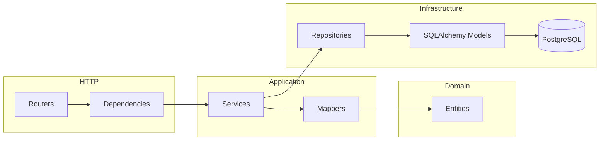
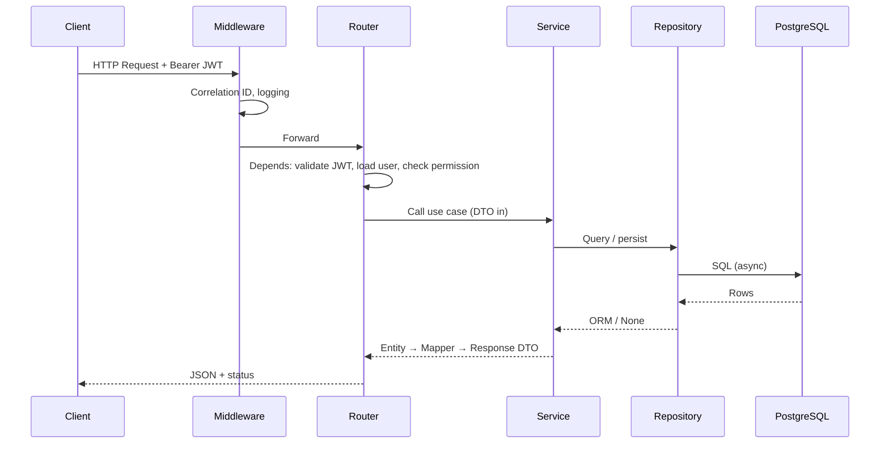
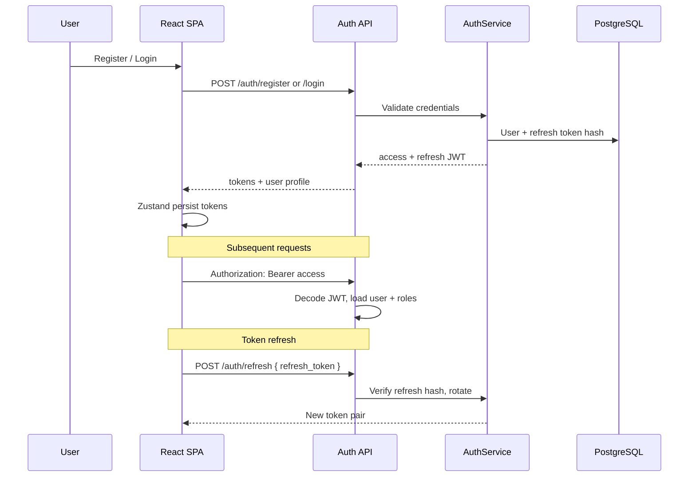
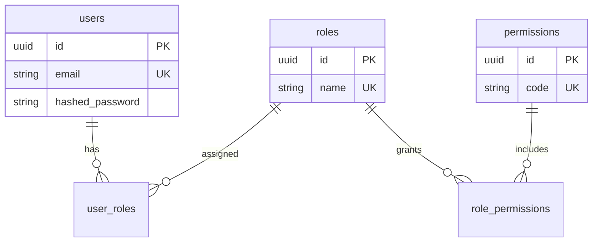
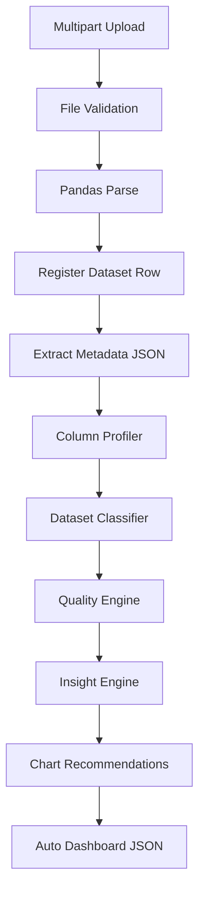
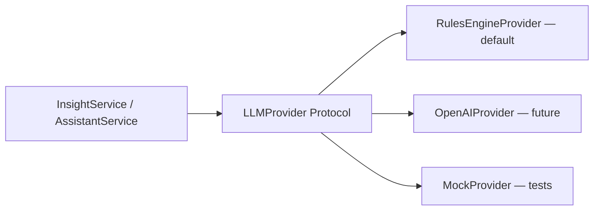
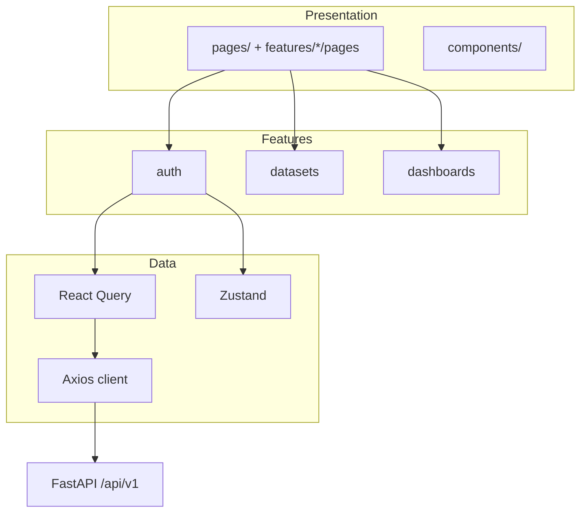

# InsightForge AI — Detailed System Architecture

## 1. Layered Backend Architecture

### Layer Rules

| Layer | May depend on | Must not |
|-------|---------------|----------|
| **api/** | schemas, services (via Depends), deps | Import ORM models in route handlers |
| **services/** | entities, repositories, mappers, core | Return ORM models to API |
| **repositories/** | models, database session | Contain business rules |
| **entities/** | stdlib only | Know about FastAPI or SQLAlchemy |
| **schemas/** | Pydantic only | Contain logic |
| **mappers/** | entities, models, schemas | Perform I/O |

## 2. Request Lifecycle

## 3. Authentication Flow

## 4. Authorization (RBAC)

**Roles (built-in):** `admin`, `analyst`, `manager`, `executive`

**Enforcement:**

- `get_current_user` — valid access JWT + active user
- `require_roles(*names)` — user has at least one role
- `require_permission(code)` — user’s roles include permission

## 5. Dataset Processing Pipeline (Phase 2+)

Processing runs **in-process** on the API worker for MVP (no message broker required).

## 6. AI / LLM Integration (Future-Ready)

Context assembly:

1. Dataset metadata + quality summary + sample stats
2. Recent insights and KPIs
3. User question (assistant)
4. Prompt template → provider → structured JSON response

## 7. Frontend Architecture

- **Route guards:** `ProtectedRoute`, `PublicRoute`
- **Token refresh:** Axios interceptor (401 → clear auth; refresh hook in Phase 1 enhancement)
- **Feature boundaries:** Each feature owns `api/`, `hooks/`, `types/`, optional `store/`

## 8. Security Architecture

| Threat | Mitigation |
|--------|------------|
| Credential theft | bcrypt hashing, short-lived access JWT, hashed refresh tokens in DB |
| Broken access control | RBAC on endpoints, user-scoped dataset queries |
| Injection | SQLAlchemy parameterized queries, Pydantic validation |
| XSS | React escaping; API returns JSON only |
| CSRF | SPA + Bearer tokens (no cookie session for API) |
| File upload abuse | Extension/MIME/size limits, virus scan hook (future) |
| Abuse / DoS | Rate-limit middleware architecture (IP sliding window stub) |

## 9. Multi-Tenancy (Future)

- Add `organizations` table
- Set `organization_id` on `users`, `datasets`, `dashboards`, …
- Repository base filter: `WHERE organization_id = :tenant`
- JWT claim: `org_id` for tenant context

## 10. API Versioning

- Prefix: `/api/v1`
- Breaking changes → `/api/v2`
- OpenAPI at `/docs` (development only)
