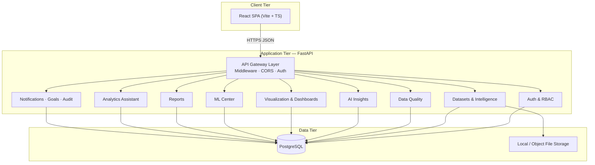

# InsightForge AI — High-Level System Design

## 1. Vision

InsightForge AI is a **universal AI-powered business intelligence and analytics SaaS platform**. End users upload datasets (CSV, Excel, JSON) and receive automated profiling, data quality scoring, business insights, visualization recommendations, dashboards, ML analysis, forecasting, and reports—**without SQL or coding**.

## 2. Architectural Style

| Principle | Application |
|-----------|-------------|
| **Clean Architecture** | API → Services → Repositories → ORM; domain entities isolated from persistence |
| **Modular monolith** | Single deployable API with feature packages (`auth`, `datasets`, `ml`, …) |
| **API-first** | OpenAPI-documented REST (`/api/v1`) consumed by React SPA |
| **Multi-tenant ready** | Optional `organization_id` on tenant-scoped entities |
| **LLM-ready** | Insight and assistant modules use provider interfaces (stub rules engine today, OpenAI later) |

## 3. Logical Architecture



## 4. Core User Journey

```
Upload Dataset
    → Dataset Intelligence Engine (column types, dataset classification)
    → Data Quality Center (completeness, consistency, accuracy scores)
    → AI Insight Engine (positives, warnings, risks, opportunities)
    → Visualization Recommendations
    → Auto Dashboard Generator
    → Advanced Analytics · ML · Forecasting
    → Reports · Notifications · Goals
```

## 5. Module Map (14 Platform Capabilities)

| # | Capability | Backend Package | Primary Data |
|---|------------|-----------------|--------------|
| 1 | Authentication & Authorization | `auth/` | users, roles, permissions, tokens |
| 2 | User Management | `services/`, `api/` | users |
| 3 | Dataset Upload Center | `datasets/` | datasets, dataset_metadata |
| 4 | Dataset Intelligence Engine | `datasets/intelligence/` | dataset_metadata |
| 5 | Data Quality Center | `datasets/quality/` | quality reports (JSON) |
| 6 | AI Insight Engine | `analytics/insights/` | insights |
| 7 | Executive Dashboard | `dashboards/` | dashboards, dashboard_widgets |
| 8 | Visualization Studio | `dashboards/visualizations/` | widget configs |
| 9 | Auto Dashboard Generator | `dashboards/generator/` | dashboard JSON |
| 10 | Advanced Analytics Center | `analytics/` | computed aggregates |
| 11 | Machine Learning Center | `ml/` | ml_models, forecasts |
| 12 | AI Analytics Assistant | `assistant/` | assistant_conversations |
| 13 | What-If Analysis | `analytics/whatif/` | simulation results |
| 14 | Report · Notification · Goal · Audit | `reports/`, `notifications/`, `goals/`, `audit/` | respective tables |

## 6. Cross-Cutting Concerns

- **Security:** JWT access + refresh, RBAC, password hashing (bcrypt), input validation (Pydantic), secure upload validation (Phase 2+)
- **Observability:** Structured logging (structlog), correlation IDs
- **Consistency:** UUID PKs, `created_at` / `updated_at` / `deleted_at`, soft deletes
- **Testing:** pytest (backend), Vitest + RTL (frontend)
- **Async I/O:** SQLAlchemy 2.0 async + asyncpg

## 7. Technology Stack

| Layer | Stack |
|-------|--------|
| API | FastAPI, Pydantic v2, Python 3.12+ |
| ORM | SQLAlchemy 2.0, Alembic |
| Database | PostgreSQL |
| Analytics / ML | Pandas, NumPy, scikit-learn |
| Reports | ReportLab, OpenPyXL |
| Frontend | React, TypeScript, Vite, React Query, Zustand, Tailwind, Recharts |
| Future AI | OpenAI-compatible provider interface |

## 8. Deployment Model (Simplified)

- **API:** Uvicorn process(es) behind your chosen reverse proxy (not bundled in repo)
- **Database:** Managed or local PostgreSQL
- **Files:** Configurable upload directory (local disk); S3 adapter optional later
- **Background work:** Synchronous in-request for MVP (pandas/sklearn on uploaded files); optional job queue in a future phase

## 9. Implementation Phases

| Phase | Scope |
|-------|--------|
| **0** | Foundation — app shell, health, logging, DB session |
| **1** | Auth & RBAC — **current** |
| **2** | Dataset upload & metadata |
| **3** | Intelligence & data quality |
| **4** | Insights & assistant (LLM-ready) |
| **5** | Visualization & auto dashboards |
| **6** | ML center |
| **7** | Reports, notifications, goals |
| **8** | Audit & hardening |
| **9** | Frontend feature parity |

See [IMPLEMENTATION_ROADMAP.md](./IMPLEMENTATION_ROADMAP.md) for sprint mapping.
